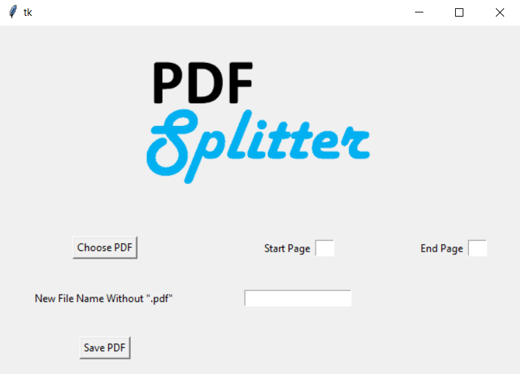

# PDF-Splitter-GUI
* Created a PDF splitter with a GUI that allows the user to create a new PDF based on a specified page range.
* View a demonstration of the splitter [here](https://www.youtube.com/watch?v=ZMBjYjOK1lM).
* If you run the code, please download the "logo.png" file (In addition to the IPython notebook) and save it to your working directory.
* Below is a screenshot of the interface.

